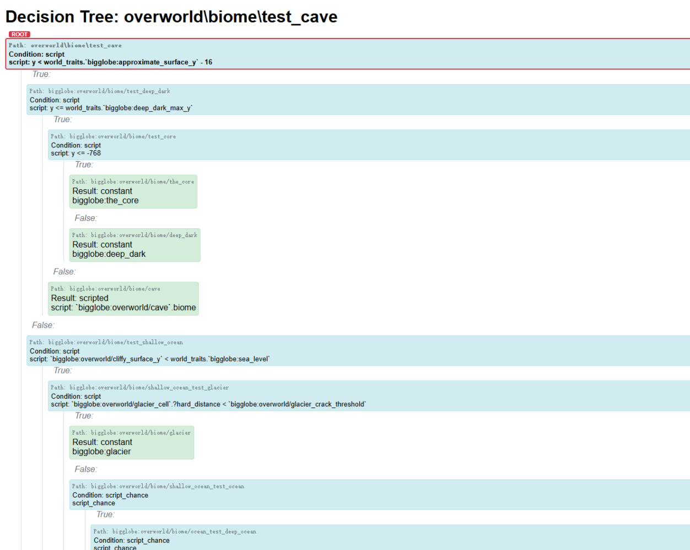

# DaoKongOS

## Pages

[(Home)](/)

[(Minecraft)](/pages/minecraft)

[(..)](./../hyper-world)

---

## Hyper World Blogs

### **PREVIEW：**
> 2025/05/09

地形生成决策树可视化工具（AI搓的）；

具体细节还得慢慢研究（

> 2025/05/05

我正在尝试为整合包添加更多生成兼容并修复一些地形生成问题；

后续版本可能会大改地形生成、记得备份存档。

> 2025/05/04

### **V1.12.5 & UI UPDATE：**
> 2025/04/11

没有内容...

---

