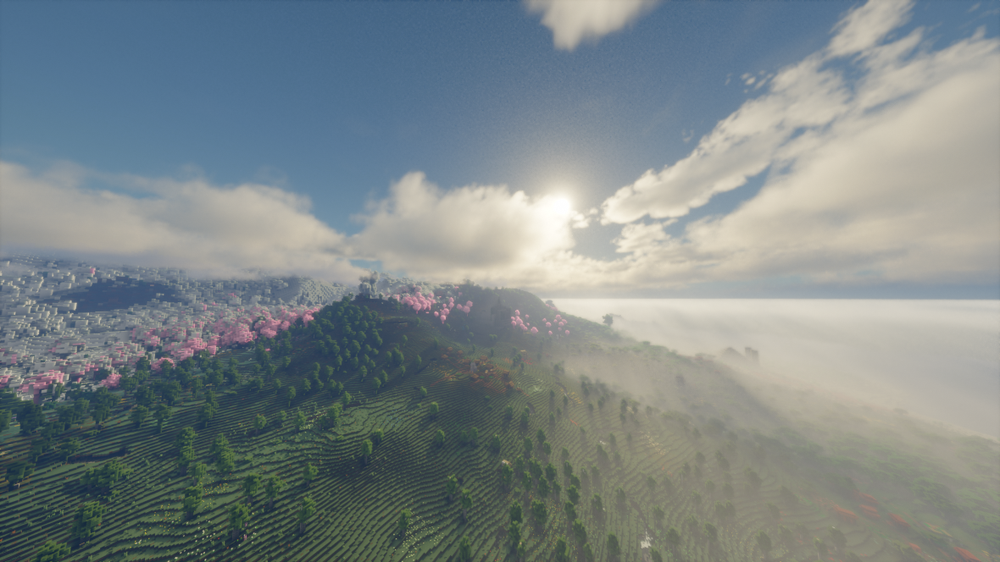
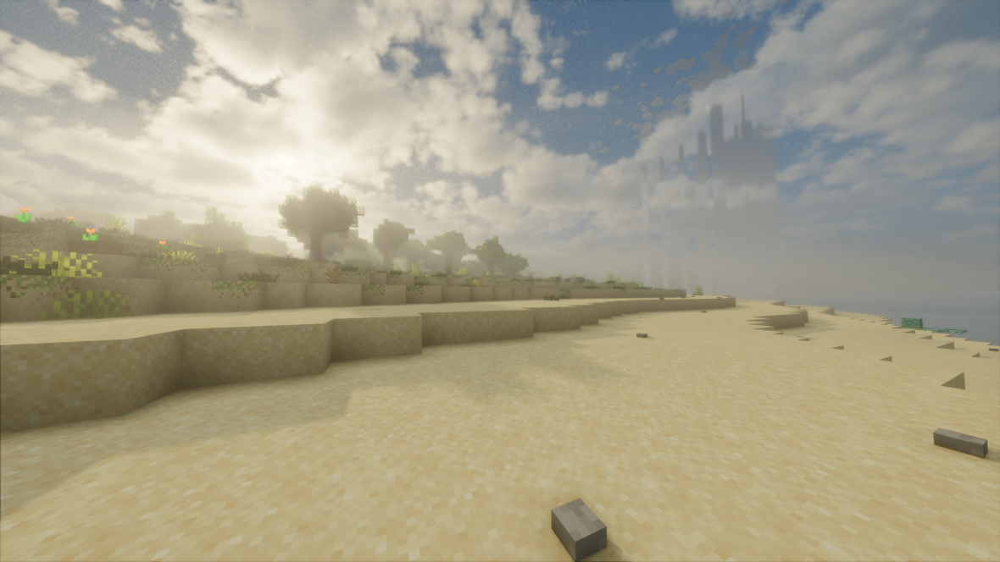
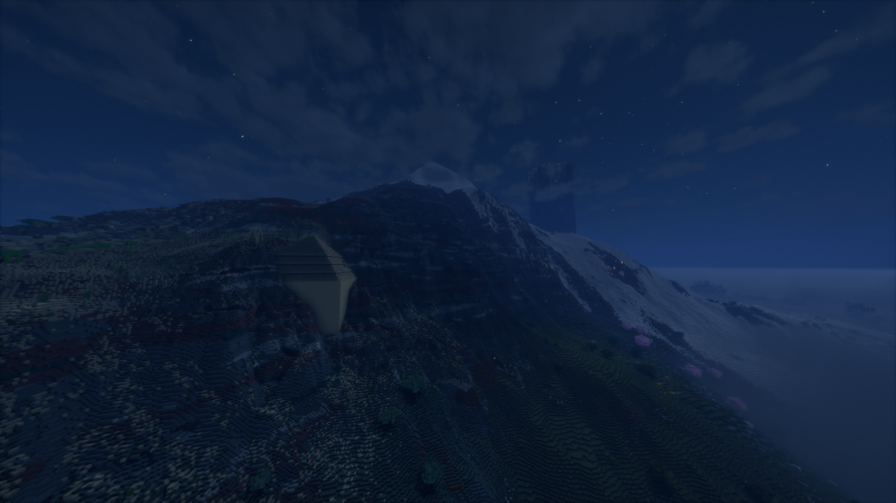
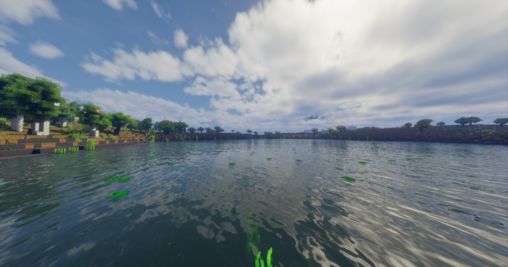

# DaoKongOS

## Pages

[(Home)](/)

[(Minecraft)](/pages/minecraft)

---

# Hyper World 整合包


> 别人的世界？我们的世界————

这是一个基于Big Globe模组的生存冒险向"水槽包"；

```text
核心模组Big Globe将世界高度更改为2048，因此可以生成非常震撼的地形；

添加了沉浸式飞机和指路石模组以便在如此大的世界中快速移动；

添加了遥远地平线和优化全家桶；

添加了一系列装饰性模组和农业相关模组；

以及其他增加游戏可玩性的模组。
```

> 由于本整合包同时包含来自Modrinth和CurseForge的模组，因此无法在这两个平台上发布；
> 
> 如果发现网盘链接失效请到Github发起Issues。

## 目录

[下载](./downloads)

[更新日志](./update)

[WIKI](./wiki)

[TODO](./todos)

[BLOG](./blog)

[疑难杂症](./questions)

[问题反馈(Github)](https://github.com/YELANDAOKONG/McPackHyperWorld/)

[数据包(Github)](https://github.com/YELANDAOKONG/HyperWorldBuilder/)

[基础兼容数据包(Github)](https://github.com/YELANDAOKONG/HyperWorldDataPack/)

> 
> ### 其他链接
> [MC百科](https://www.mcmod.cn/modpack/1076.html)
>
> [红石中继站](https://www.mczwlt.net/resource/ze9gi29s)
> 
> [MineBBS 发布帖](https://www.minebbs.com/resources/1-20-1-fabric-gao-you-hua-sheng-cun-de-xing-yao-yuan-de-ping-xian-you-fu-wu-duan-hyper-world.10970/)
>
> [苦力怕论坛 发布帖](https://klpbbs.com/thread-159648-1-1.html)
>


## 温馨提示&推荐配置

客户端默认禁用DH的LOD生成及渲染，如有需要可以手动开启(**请注意内存使用率**)；

如果游戏*一卡一卡的还未响应*，**通常是内存分配不足，请检查JAVA内存分配**；

**请注意存档备份**；

### 服务器
1. 如果是面板服开服的话，建议服务器**使用4个及以上的CPU核心**以及**8GB及以上**的内存
2. 跑图和生成区块**很吃CPU**，对CPU要求较高，建议提前使用Chunky命令预生成区块
3. 推荐使用Java 21环境

### 客户端
1. 建议为MC分配**12GB及以上内存（开DH的话需要更多）**
2. 推荐光影Bliss开发版
3. 存档有亿点点大，特别是开了DH的时候，**请注意磁盘空间**

## TODO List

请移步至 [TODO 子页面](./todos) 查看

## 已知不兼容&问题

### 已知不兼容
- [格雷科技现代版](https://www.mcmod.cn/class/12850.html)

~~其他忘了（~~

### 已知兼容

（整合包本身不包含，按需手动添加）

- [Yes Steve Model](https://www.mcmod.cn/class/8616.html)

### 未经测试

（加入后可以进入游戏但功能与兼容性未经测试、不提供兼容性支持）

- [ViveCraft](https://www.mcmod.cn/class/1119.html)
- [ViveCraft Compat](https://www.mcmod.cn/class/11689.html)

### 已知问题

- **机械动力的液态经验相关物品在思索时 `必定` 会引发游戏客户端崩溃，请注意。**
- 精妙模组的合成升级和REI的一键填充有小概率因为数组索引异常导致客户端游戏崩溃
- 建议使用默认的Big Globe生成器，Big Globe提供的Islands生成器（“大地球：群岛”）可能不会生成模组的矿物
- 有时会出现偶发性（个人游玩时一个月里面出现了四次）因渲染器DLL空指针导致的JVM崩溃（部分材质包也可能导致靠近某些区块时崩溃），请注意存档备份

## 已修改的配方

### 如何获得模组农作物/种子？

由于Big Globe大改了地形生成，很多模组的野生作物及种子无法通过正常方式获取；

~~做数据包添加生成兼容挺麻烦而且游戏里难找（~~

因此配方修改为：

- 种子可以通过机械动力的石磨磨草（包括模组中的）概率获得
- 野生农作物系列可以通过磨高草（包括模组中的）概率获得
- 高草现在可以用草（包括模组中的）合成

## 安装整合包

客户端下载ZIP包之后拖进 HMCL / PCL 等启动器即可安装；

服务端下载7Z包之后解压，命令行启动`loader.jar`会自动下载服务端并启动服务端；

## 二次修改说明

**要对整合包进行二次修改，您必须遵守以下协议：**

1. 所有修改版与本整合包原作者无关，修改版造成的任何后果，原作者不承担任何责任；
2. 本整合包免费提供，禁止收费售卖分发本整合包；
3. 禁止用于任何商业活动（包括但不限于使用或基于本整合包开设商业服务器、盈利性宣传等）；
4. 进行修改或二次分发需要自行承担相关责任，作者不对修改版本的内容、功能或安全性做任何保障；
5. 公开发布修改版本时，必须标明“基于 Hyper World 整合包修改”，并注明原作者信息；
6. 一旦您对整合包进行修改或二次分发，则代表您已阅读、理解并同意遵守本协议的所有条款。

## Q&A

暂无

## 预览图










---

<script src="https://giscus.app/client.js"
        data-repo="YELANDAOKONG/DaoKongOS"
        data-repo-id="R_kgDOOCWX7g"
        data-category="Announcements"
        data-category-id="DIC_kwDOOCWX7s4CngzH"
        data-mapping="pathname"
        data-strict="0"
        data-reactions-enabled="1"
        data-emit-metadata="0"
        data-input-position="top"
        data-theme="preferred_color_scheme"
        data-lang="zh-CN"
        crossorigin="anonymous"
        async>
</script>

<script>
    var _hmt = _hmt || [];
    (function() {
        var hm = document.createElement("script");
        hm.src = "https://hm.baidu.com/hm.js?e467154e934c2dc14879fbb2df219013";
        var s = document.getElementsByTagName("script")[0];
        s.parentNode.insertBefore(hm, s);
    })();
</script>
