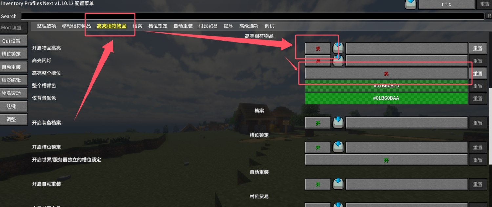
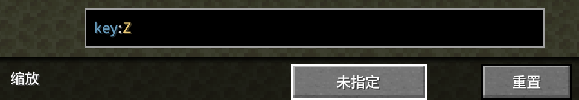

# DaoKongOS

## Pages

[(Home)](/)

[(Minecraft)](/pages/minecraft)

[(..)](./../hyper-world)

---

## Hyper World 整合包疑难杂症

### Q: 鼠标悬浮选中的物品栏格子变绿？

A: 物品高亮是 IPN (Inventory Profiles Next) 模组的功能，可以在模组配置页面关闭。

> 此问题已在V1.12.2更新时修复（默认已禁用）。

### Q: 按住Z键的时候视角和小地图一起缩放？

A: 按键设置问题，在设置中将Z键"缩放"的快捷键改成"未指定(ESC)"即可（已有按C放大）。

> 此问题已在V1.12.2更新时修复（默认键位）。

### Q: 手动选择BGM？

A: 更改按键设置，把以下两项改成自己习惯且未被占用的按键。

> 此问题已在V1.12.2更新时修复（默认键位）。

---

