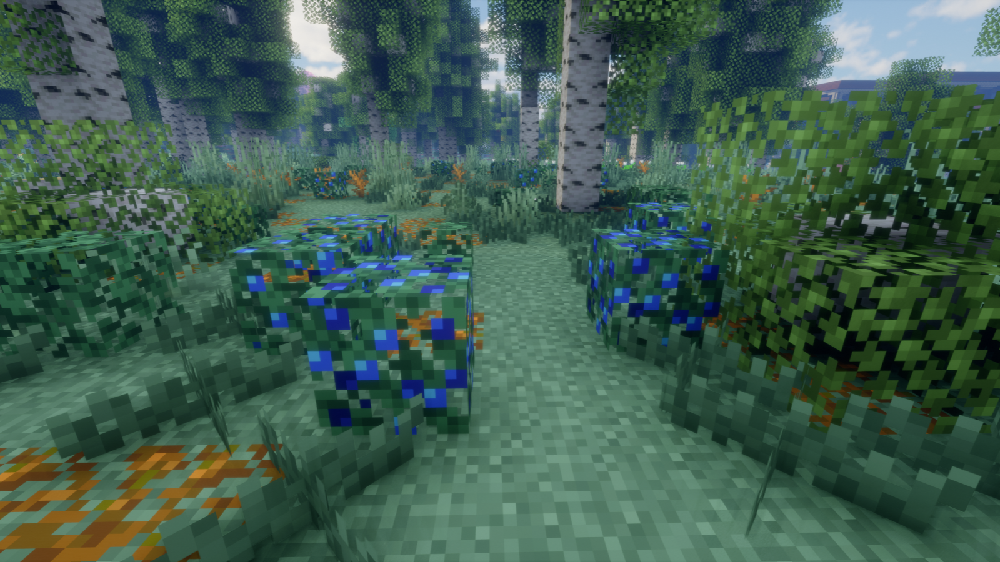
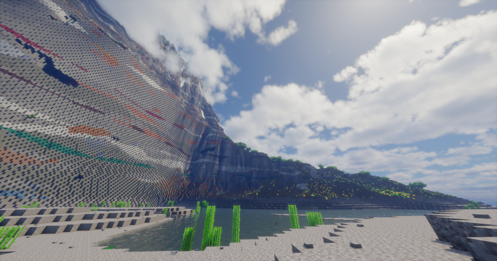

# DaoKongOS

## Pages

[(Home)](/)

[(Minecraft)](/pages/minecraft)

[(..)](./../hyper-world)

---

## Hyper World 整合包更新日志

### **V1.13.1 & UI UPDATE：**
> 2025/05/26

- 将核心模组 Big Globe 更新到最新版本 (v5.0.2)
- 更新小地图/世界地图模组到最新版本

以下农作物现在可以在世界中自然生成：

- 小麦（原版）
- 胡萝卜（原版）
- 土豆（原版）
- 甜菜根（原版）
- 南瓜（原版）
- 西瓜（原版）
- 卷心菜（[农夫乐事](https://www.mcmod.cn/class/2820.html)）
- 番茄（[农夫乐事](https://www.mcmod.cn/class/2820.html)）
- 稻米（[农夫乐事](https://www.mcmod.cn/class/2820.html)）
- 野生卷心菜（[农夫乐事](https://www.mcmod.cn/class/2820.html)）
- 野生洋葱（[农夫乐事](https://www.mcmod.cn/class/2820.html)）
- 野生番茄（[农夫乐事](https://www.mcmod.cn/class/2820.html)）
- 野生胡萝卜（[农夫乐事](https://www.mcmod.cn/class/2820.html)）
- 野生土豆（[农夫乐事](https://www.mcmod.cn/class/2820.html)）
- 野生甜菜根（[农夫乐事](https://www.mcmod.cn/class/2820.html)）
- 野生稻米（[农夫乐事](https://www.mcmod.cn/class/2820.html)）
- 番茄（[沉浸农艺](https://www.mcmod.cn/class/16100.html)）
- 生菜（[沉浸农艺](https://www.mcmod.cn/class/16100.html)）
- 燕麦（[沉浸农艺](https://www.mcmod.cn/class/16100.html)）
- 大麦（[沉浸农艺](https://www.mcmod.cn/class/16100.html)）
- 玉米（[沉浸农艺](https://www.mcmod.cn/class/16100.html)）
- 野生玉米（[沉浸农艺](https://www.mcmod.cn/class/16100.html)）
- 野生大麦（[沉浸农艺](https://www.mcmod.cn/class/16100.html)）
- 野生燕麦（[沉浸农艺](https://www.mcmod.cn/class/16100.html)）
- 野生胡萝卜（[沉浸农艺](https://www.mcmod.cn/class/16100.html)）
- 野生甜菜根（[沉浸农艺](https://www.mcmod.cn/class/16100.html)）
- 野生土豆（[沉浸农艺](https://www.mcmod.cn/class/16100.html)）
- 野生番茄（[沉浸农艺](https://www.mcmod.cn/class/16100.html)）
- 野生生菜（[沉浸农艺](https://www.mcmod.cn/class/16100.html)）
- 野生洋葱（[沉浸农艺](https://www.mcmod.cn/class/16100.html)）
- 野生草莓（[沉浸农艺](https://www.mcmod.cn/class/16100.html)）
- 野生车前草（[沉浸农艺](https://www.mcmod.cn/class/16100.html)）
- 野生荨麻（[沉浸农艺](https://www.mcmod.cn/class/16100.html)）
- 野生二粒小麦（[沉浸农艺](https://www.mcmod.cn/class/16100.html)）
- 黄瓜（[多元乐事](https://www.mcmod.cn/class/5609.html)）
- 茄子（[多元乐事](https://www.mcmod.cn/class/5609.html)）
- 玉米（[多元乐事](https://www.mcmod.cn/class/5609.html)）
- 野生黄瓜（[多元乐事](https://www.mcmod.cn/class/5609.html)）
- 野生玉米（[多元乐事](https://www.mcmod.cn/class/5609.html)）
- 野生茄子（[多元乐事](https://www.mcmod.cn/class/5609.html)）
- 芦笋（[多元乐事](https://www.mcmod.cn/class/5609.html)）
- 辣椒（[多元乐事](https://www.mcmod.cn/class/5609.html)）
- 红薯（[多元乐事](https://www.mcmod.cn/class/5609.html)）
- 花生（[多元乐事](https://www.mcmod.cn/class/5609.html)）
- 野生芦笋（[多元乐事](https://www.mcmod.cn/class/5609.html)）
- 野生红薯（[多元乐事](https://www.mcmod.cn/class/5609.html)）
- 野生辣椒（[多元乐事](https://www.mcmod.cn/class/5609.html)）
- 野生花生（[多元乐事](https://www.mcmod.cn/class/5609.html)）
- 啤酒花（[盛节精酿](https://www.mcmod.cn/class/13710.html)）
- 亚麻（[锦致装饰](https://www.mcmod.cn/class/3555.html)）
- 野生生姜（[Snowy Spirit](https://www.mcmod.cn/class/7511.html)）
- 甜浆果（原版）
- 蓝莓（[更多浆果](https://www.mcmod.cn/class/2367.html)）
- 黄莓（[更多浆果](https://www.mcmod.cn/class/2367.html)）
- 橙莓（[更多浆果](https://www.mcmod.cn/class/2367.html)）
- 紫莓（[更多浆果](https://www.mcmod.cn/class/2367.html)）
- 绿莓（[更多浆果](https://www.mcmod.cn/class/2367.html)）
- 黑莓（[更多浆果](https://www.mcmod.cn/class/2367.html)）

由于并非所有模组的农作物都做了生成兼容，因此仍然保留磨草获得野生农作物及其种子的配方。

此版本新增了一个全局数据包；服务端迁移旧版本存档时请注意复制新数据包到存档目录中。

### **V1.13.0 & UI UPDATE：**
> 2025/05/15

- 将核心模组 Big Globe 更新到最新版本 (v5.0.1)
- 完全移除失落城市及方尖碑
- 添加 BiomesOPlenty 模组 (暂未实现任何生成兼容)
- 移除 Big Globe - Universal Ores Compatibility 模组
- 移除 Big Globe - Mythic Metals Compatibility 模组

本次更新删除了不兼容最新版 Big Globe 模组的两个兼容性模组，并添加了全局数据包 (强制/默认启用) 以替代原模组功能；

由于服务器端无法使用全局数据包模组，因此使用服务器端时**请在初次创建/重新创建存档之前，复制`global_packs\required_data\`下所有文件到`world\datapacks\`下(根据实际存档路径修改)**，
否则服务器世界将不会生成部分模组的建筑、矿石等资源。

**!!! 升级时请注意备份存档 !!!**

由于 Big Globe v5.0.0 官方更新日志中提到 `Not backwards-compatible with existing worlds` (不向后兼容现有世界)，
因此在升级存档时**务必做好存档备份** (实际测试发现有部分世界会出现卡安全模式界面的问题)！

### **V1.12.5 & UI UPDATE：**
> 2025/04/11

- 将遥远地平线模组更新到最新版本 (2.3.2-b)
- 新增Universal Ores模组及其生成兼容
- 新增Towns and Towers模组及其生成兼容
- 新增When Dungeons Arise模组及其生成兼容
- 新增When Dungeons Arise Seven Sea模组
- 新增Unwrecked Ships模组及其生成兼容
- 新增Antique Trading Ship模组及其生成兼容
- 新增Create Structures模组及其生成兼容
- 新增Create Structures Arise模组
- (当前版本还没有制作任务线)

由于 Big Globe 模组 v1.12.0 版本改动大且不兼容任何已有数据包/兼容性模组，因此本版本暂不更新此模组。

### **V1.12.4 & UI UPDATE：**
> 2025/03/23

- 将部分模组更新到最新版本
- (当前版本还没有制作任务线)

### **V1.12.3 & UI UPDATE：**
> 2025/03/12

- 新增Carry On模组
- 新增First-person Model模组（默认禁用）
- (当前版本还没有制作任务线)

### **V1.12.2 & UI UPDATE：**
> 2025/03/12

- 修复启动游戏时因主菜单UI数组异常导致的游戏崩溃问题
- 默认禁用IPN模组的物品高亮
- 修改部分默认键位
- 更新遥远地平线模组至最新版（2.3.0-b）
- 深度清理Config文件夹下某些模组的残余数据文件
- (当前版本还没有制作任务线)

### **V1.12.1 UPDATE：**
> 2025/03/10

- 小优化

### **V1.12.0 & UI UPDATE：**
> 2025/03/08

- 主界面及UI优化
- (当前版本还没有制作任务线)

### **V1.12.0 UPDATE：**
> 2025/03/02

- 新增Chipped及ChippedExpress模组
- 正式公开发布

### **OLDER UPDATE：**
> 2025/01/??

更老的更新日志不再展示；

---

